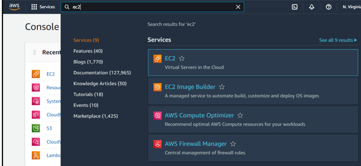
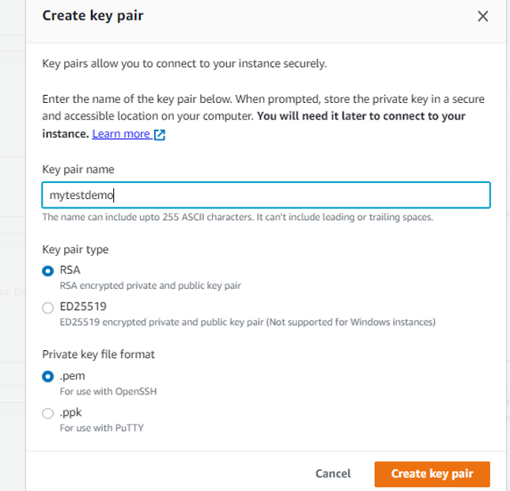
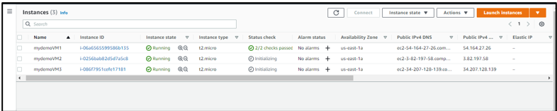
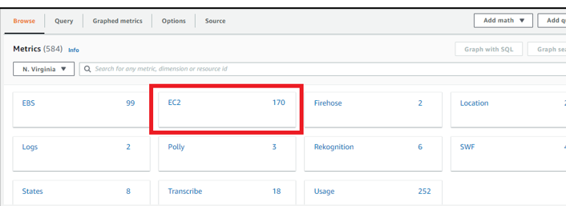
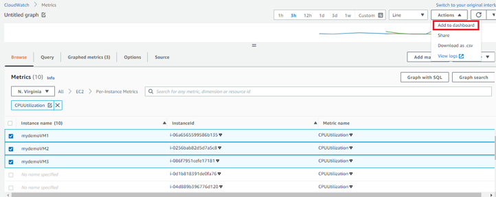
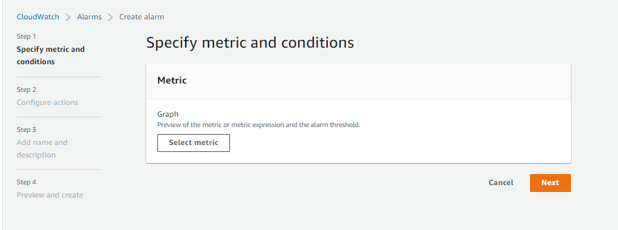
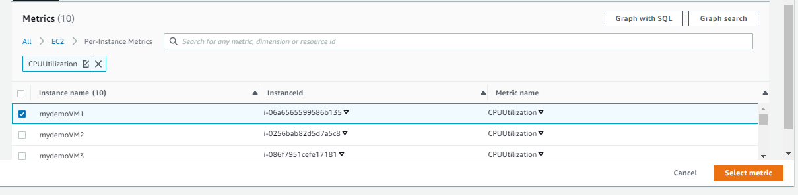
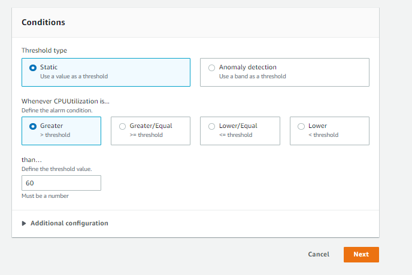
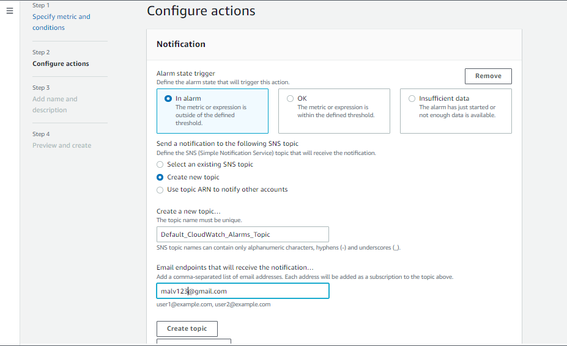
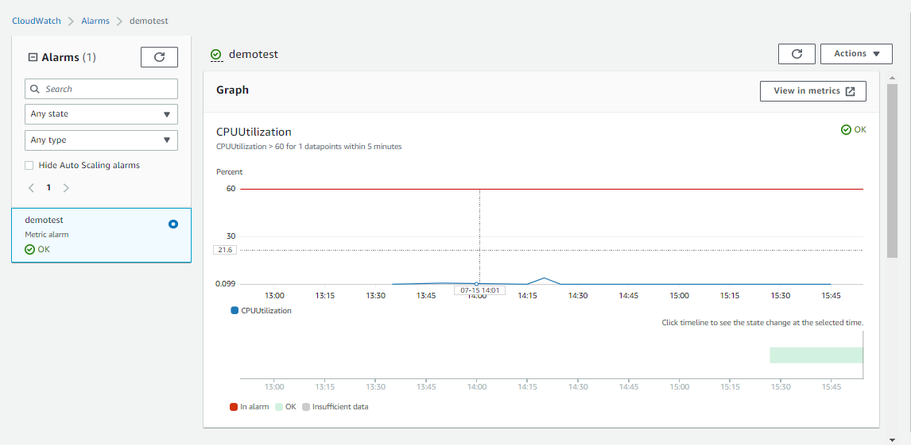

# Monitoring CPU Utilization and Setting Alarms with CloudWatch for Linux EC2 Instances

This project aims to create a CloudWatch alarm in AWS to monitor CPU Utilization metrics of three Linux virtual machine instances. By configuring threshold levels, users will receive notifications when the metrics exceed or fall below the specified thresholds. Additionally, a dashboard will be set up to display the CPU Utilization metrics of all three VMs, providing a consolidated view for easy monitoring and analysis.

## Steps to be followed

1. Launch 3 Linux VMs
2. Connect SSH into VMs, Perform Linux-related tasks on VM
3. Work with CloudWatch services
4. Select metrics for CPU utilization for all 3 VMs
5. Create an alarm and send a notification through SNS

## Services

Amazon EC2,Amazon CloudWatch,Amazon CloudWatch Alarms

## Deployment steps and Screenshot

### To deploy this project run ,

#### 1. Launch 3 Linux VMs In the Amazon console, search for EC2 in the search bar In the AWS EC2 console, select Launch Instance Add a name, select Amazon Linux Machine and t2.micro Instance type, Create a new keypair

#### 2. Create 2 more instances following the same steps Select the Instance and click on the Connect option

#### 3.Perform Linux-related tasks on VM , Run sudo yum install stress -y,Connect all the 3 VMs

#### 4. Go to the CloudWatch service

#### 5. Select metrics for CPU utilization for all 3 VMs, Click Metrics and select All,2 Select the EC2 option Metrics

#### 5.1 Select Per-Instance Metrics and search CPUUtilization in the search bar ,Select all the VMs, and click on Actions options, and select Add to dashboard

#### 6. Create an alarm Select metric then click on Next

#### 6.1 Click on EC2, select Per-Instance Metrics, and search CPUUtilization in the search bar Select one metric at a time and click on Select Metric button

#### 6.2 Give threshold value as 60 and click on Next Click on Create new topic and add an email address then click on Create topic

##### 6.3Add a Name for alarm and click on Create alarm

