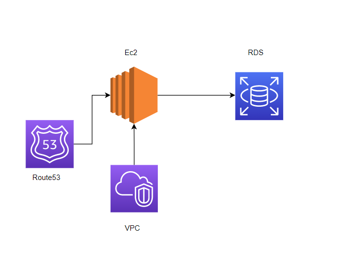

# MySQL Database Instance with a Web Server and Set up the Monitoring of the Solution

organization wants to deploy a new multi-tier application. The application will take live inputs from the employees, and it will be hosted on a web server running on the AWS cloud. The development team has asked you to set up the web server and configure it to scale automatically in cases of a traffic surge, to make the application highly available. They have also asked you to take the inputs from the employees and store them securely in the database.

## Steps to be followed

1. vpc and Ec2 created
2. RDS with VPC security group
3. Apache Web Server installed and connected to database 

## Resource visualizer(Architect Diagram)

## Services

virtual private cloud(VPC),Ec2 instance, RDS, Route 53

## Deployment steps and Screenshot

### To deploy this project run ,

#### 1.create VPC with three subnets public and private

#### 2.Ec2 instance created with VPC

#### 3. RDS with database with vpc security group

#### 4.Connected and install the commands By using documentation

https://docs.aws.amazon.com/AmazonRDS/latest/UserGuide/CHAP_Tutorials.WebServerDB.CreateWebServer.html

#### 5. It was an sample php page with name and address and stored in database

#### 6.In route 53 health checked

