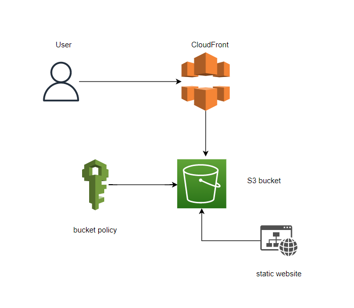

# Approach in SaaS

## Steps to be followed

1. Creating an S3 bucket
2. Generating Bucket Policy
3. Enabling static website hosting by uploading index.html content
4. Testing and verifying the hosted content
5. CloudFront distribution

## Resource visualizer(Architect Diagram)

## Services

## Deployment steps and Screenshot

### To deploy this project run ,

#### 1.Create an S3 bucket Set permissions section, uncheck the box of Block all public access

#### 2.In the properties of S3 bucket, configure the S3 bucket to enable Static website hosting

#### 3.In the properties of S3 bucket, configure the S3 bucket to enable Static website hosting

#### 4.Configure permissions in S3 and add below bucket policy to give read only access to the static web app endpoint

{
"Version":"2012-10-17",
"Statement":[
{
"Sid":"PublicRead", "Effect":"Allow", "Principal": "_",
"Action":["s3:GetObject"],
"Resource":["arn:aws:s3:::cloudcapstone123/_"] } ]
}

#### 5. Click on the Object URL to verifying application is running

#### 6.Now create a CloudFront distribution corresponding to the static web app endpoint

#### 7. Select a delivery method for your content as Web and click on Get Started

#### 8.: Provide the Origin Domain Name and Origin ID Keep all the values as default and click on Create Distribution
