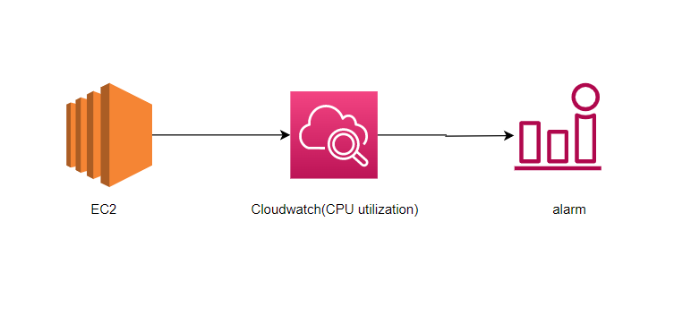
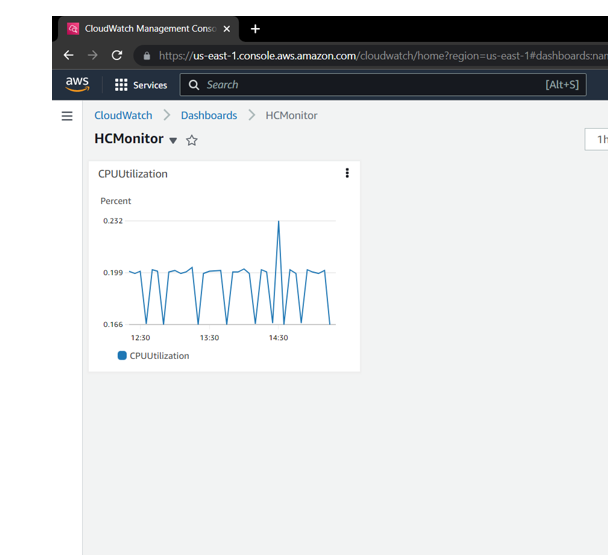
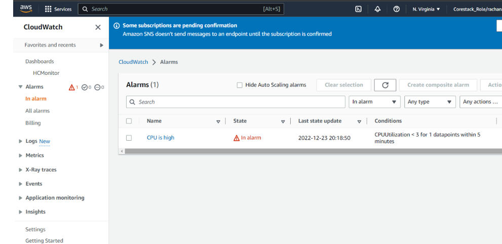
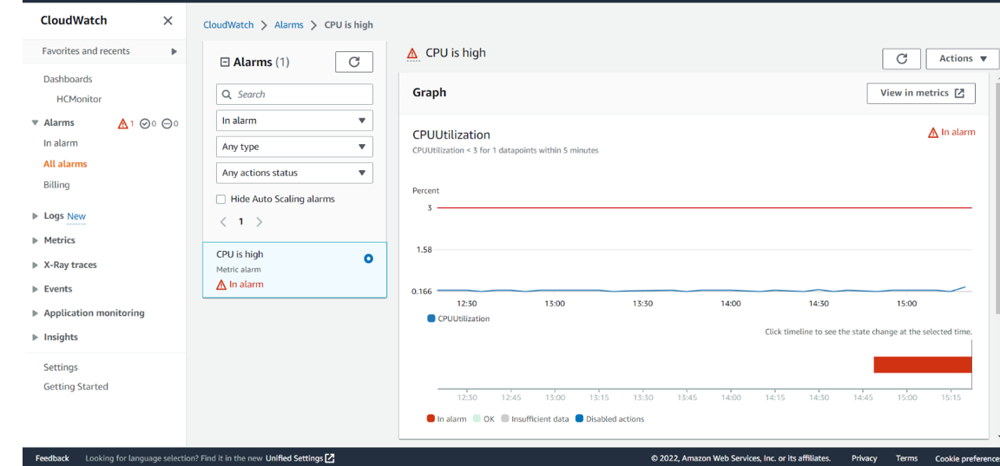
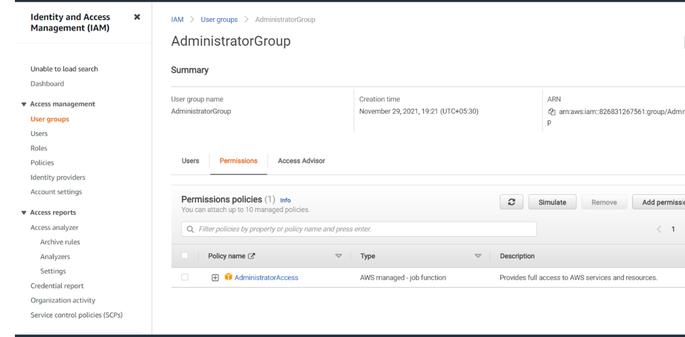
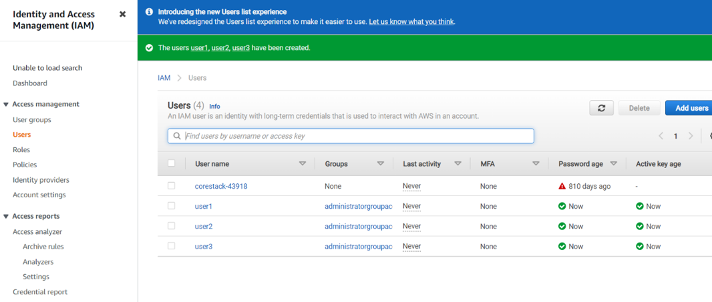

# Server Monitoring

Heaven Classics successfully creates an EC2 Server Instance for Windows 2012 Server. After launching the instance on the server, the next step was to monitor the operations.
Monitoring is important to keep an eye on the performance of an EC2 instance. It helps gather data from all parts and is useful for debugging failure.

## Steps to be followed

1.  EC2 instance
2.  Cloudwatch CPU utilitztion
3.  Alarm is set to CPU is high
4.  IAM group and Users 

## Resource visualizer(Architect Diagram)

## Services

EC2instance , Cloudwatch, IAM(Identity and access Management)

## Deployment steps and Screenshot

### To deploy this project run ,

#### 1. EC2 instance named as EC2-hc with Windows 2012 Server.

#### 2. cloudwatch CPU utilization graph as created named as HCMonitor

#### 3.Alarm is set with name of CPU is high to CPU utilization goes below the threshold of 3%, and HCMonitor@HeavenClassics.com email notification

#### 4.IAM group created with name of Administrator Group and attach the full administrator access policy to the group

#### 5. User1 , user2, user3 as created and added to Administrator Group

