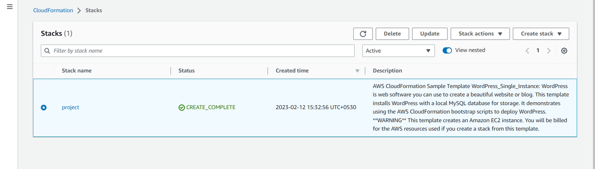
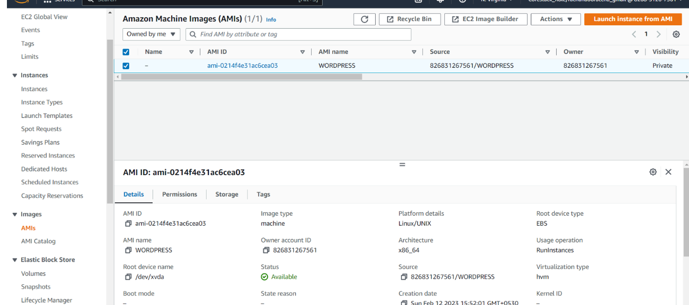
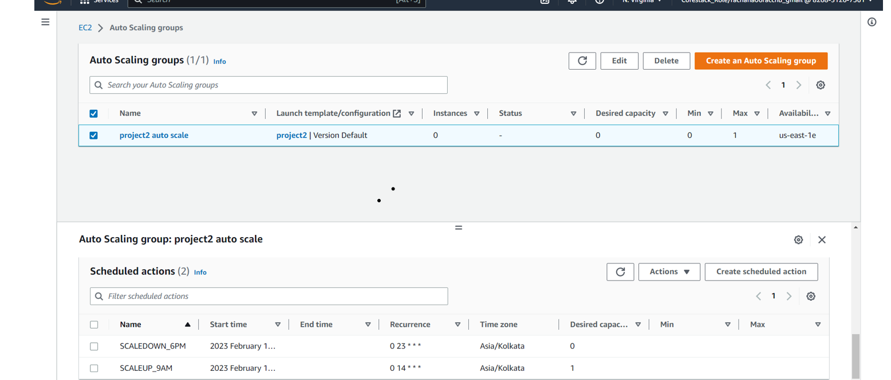
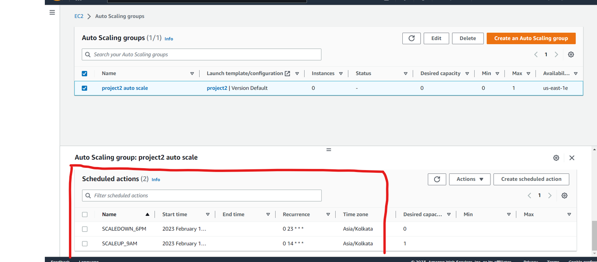

# Monitor a WordPress Instance

Your organization publishes blogs and provides documentation services for other businesses and technologies. You have been asked to:
• Set up a live WordPress instance to publish blogs
• Set up a WordPress instance that can be used for development and testing purposes so that any work done on this instance will not impact the live blog
• Configure the WordPress instance for development and testing purposes, which will be available only for business hours (9 AM–6 PM)
• Monitor the health of the WordPress instance

## Steps to be followed

1. Create a CloudFormation new stack
2. Create an AMI of the WordPress instance
3. Configure Auto Scaling to launch a new WordPress instance
4. Configure the new WordPress instance to shut down automatically

## Services

CloudFormation,Auto Scaling,Ec2intance(AMI image)

## Deployment steps and Screenshot

### To deploy this project run ,

#### 1. Created a CloudFormation project stack

#### 2. Created an AMI of the WordPress instance

#### 3. Auto Scaling of launch of WordPress instance with scheduled action

#### 4. Configure the new WordPress instance to shut down automatically it will be available only for business hours (9 AM–6 PM)

#### 5. Ec2 instances of project2 by CloudFormation of WordPress blog is created

